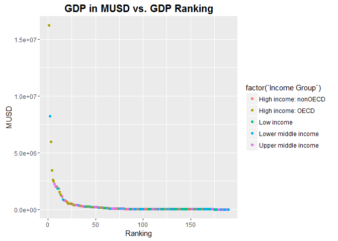
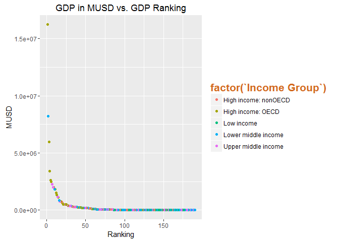
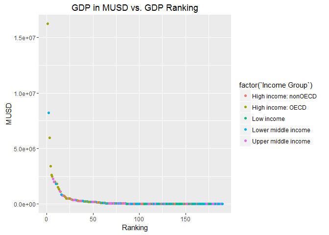

# CaseStudy1
Jacob Brionez  
October 27, 2016  
#Introduction

The World Bank Group has set two goals for the world to achieve by 2030:

End extreme poverty by decreasing the percentage of people living on less than $1.90 a day to no more than 3%

Promote shared prosperity by fostering the income growth of the bottom 40% for every country

The World Bank is a vital source of financial and technical assistance to developing countries around the world. The World Bank Group comprises five institutions managed by their member countries.
Established in 1944, the World Bank Group is headquartered in Washington, D.C. We have more than 10,000 employees
in more than 120 offices worldwide.

The World Bank also provides free and open access to global development data that it collects on their website
at data.worldbank.org.  This analysis will utilize this data to provide insight into countries of various GDP
levels and the income levels of the people who live in those countries.  

We are utilizing the following queried data sets in our analysis:
Education Statistics - The World Bank EdStats All Indicator Query
GDP Ranking - Gross domestic product ranking table


#Installed Packages

```r
library(ggplot2)
library(repmis)
library(RCurl)
```

```
## Loading required package: bitops
```

#Downloading URL and clean up prep for Merge

```r
site <-"https://d396qusza40orc.cloudfront.net/getdata%2Fdata%2FGDP.csv"
GDP <- source_data(site, sep=",", header=FALSE)
```

```
## Downloading data from: https://d396qusza40orc.cloudfront.net/getdata%2Fdata%2FGDP.csv
```

```
## SHA-1 hash of the downloaded data file is:
## 18dd2f9ca509a8ace7d8de3831a8f842124c533d
```

```
## Warning in fread(data, sep = sep, header = header, data.table = F,
## stringsAsFactors = stringsAsFactors, : Bumped column 6 to type character
## on data row 67, field contains 'a'. Coercing previously read values in this
## column from logical, integer or numeric back to character which may not
## be lossless; e.g., if '00' and '000' occurred before they will now be just
## '0', and there may be inconsistencies with treatment of ',,' and ',NA,' too
## (if they occurred in this column before the bump). If this matters please
## rerun and set 'colClasses' to 'character' for this column. Please note
## that column type detection uses the first 5 rows, the middle 5 rows and the
## last 5 rows, so hopefully this message should be very rare. If reporting to
## datatable-help, please rerun and include the output from verbose=TRUE.
```

```r
GDP <- GDP[-c(3,6,7,8,9,10)] #removing empty columns
names(GDP) <- c("CountryCode","Ranking","Economy","MUSD")  #Names for Columns
GDPFinal <- subset(x=GDP, MUSD != "..") #Removes .. from MUSD column
GDPFinal <- subset(x=GDPFinal, Ranking != "Gross domestic product 2012")
GDPFinal <- subset(x=GDPFinal, Ranking != "Ranking")
GDPFinal <- subset(x=GDPFinal, Ranking != "Note: Rankings include only those economies with confirmed GDP estimates. Figures in italics are for 2011 or 2010.")
GDPFinal <- subset(x=GDPFinal, Ranking != "a. Includes Former Spanish Sahara.  b. Excludes South Sudan  c. Covers mainland Tanzania only. d. Data are for the area")
GDPFinal <- subset(x=GDPFinal, Ranking != "controlled by the government of the Republic of Cyprus.   e. Excludes Abkhazia and South Ossetia.  f. Excludes Transnistria.")
GDPFinal <- subset(x=GDPFinal, Ranking >0) #Removes Outliers Items with no MUSD or that are not countries

urladdress <-"https://d396qusza40orc.cloudfront.net/getdata%2Fdata%2FEDSTATS_Country.csv"
EDU <- source_data(urladdress, sep=",", header=TRUE)
```

```
## Downloading data from: https://d396qusza40orc.cloudfront.net/getdata%2Fdata%2FEDSTATS_Country.csv
```

```
## SHA-1 hash of the downloaded data file is:
## 20be6ae8245b5a565a815c18a615a83c34745e5e
```
#Merge of Datasets GDPFinal and EDU

```r
GDPEDUdata <- merge(x=GDPFinal, y=EDU, by = "CountryCode", all=TRUE) #Merge of data by CountryCode
```
#Question 1
Merge the data based on the country shortcode. How many of the IDs match?
Based on the Merge of the Country Education Data and the Gross Domestic Product Data, there were 190 matches
for countries that had GDP data available and that had Education Data entered.

```r
GDPEDUdataRank <- subset(x=GDPEDUdata, Ranking > 0) #Remove non matched data
GDPEDUdataRank <- dplyr::arrange(GDPEDUdataRank, Ranking)
#GDPEDUdataRank[c(1:2)]
```
#Question 2
Sort the data frame in ascending order by GDP (so United States is last). What is the 13th
country in the resulting data frame?

```r
GDPEDUdataRank$MUSD<-as.numeric(gsub("\\,","",GDPEDUdataRank$MUSD)) #remove commas and change to numeric
GDPEDUdataRank$MUSD<-as.numeric(gsub("\\$","",GDPEDUdataRank$MUSD)) #remove Dollar signs and change to numeric
GDPEDUdataRank$Ranking<-as.numeric(GDPEDUdataRank$Ranking) #convert Rankings to Numeric
GDPEDUdataRank <- dplyr::arrange(GDPEDUdataRank, MUSD) #
#GDPEDUdataRank[c(1:2)]
```

KNA is the Thirteenth country on the list.

#Question 3
What are the average GDP rankings for the "High income: OECD" and "High income:nonOECD" groups?

```r
HighIncomeOECD <- subset(GDPEDUdataRank, `Income Group` == "High income: OECD")
HighIncomeOECD$Ranking<-as.numeric(HighIncomeOECD$Ranking) #convert Rankings to Numeric
HighIncomeOECD[c(1,6)] #CheckValues in Income Group Column
```

```
##     CountryCode      Income Group
## 69          ISL High income: OECD
## 111         SVN High income: OECD
## 117         LUX High income: OECD
## 128         SVK High income: OECD
## 133         HUN High income: OECD
## 136         NZL High income: OECD
## 140         CZE High income: OECD
## 145         IRL High income: OECD
## 146         PRT High income: OECD
## 148         FIN High income: OECD
## 149         GRC High income: OECD
## 151         ISR High income: OECD
## 158         DNK High income: OECD
## 164         AUT High income: OECD
## 166         BEL High income: OECD
## 167         POL High income: OECD
## 168         NOR High income: OECD
## 170         SWE High income: OECD
## 171         CHE High income: OECD
## 173         NLD High income: OECD
## 176         KOR High income: OECD
## 178         ESP High income: OECD
## 179         AUS High income: OECD
## 180         CAN High income: OECD
## 182         ITA High income: OECD
## 185         GBR High income: OECD
## 186         FRA High income: OECD
## 187         DEU High income: OECD
## 188         JPN High income: OECD
## 190         USA High income: OECD
```

```r
summary(HighIncomeOECD)
```

```
##  CountryCode           Ranking         Economy               MUSD         
##  Length:30          Min.   :  1.00   Length:30          Min.   :   13579  
##  Class :character   1st Qu.: 12.25   Class :character   1st Qu.:  211147  
##  Mode  :character   Median : 24.50   Mode  :character   Median :  486528  
##                     Mean   : 32.97                      Mean   : 1483917  
##                     3rd Qu.: 45.75                      3rd Qu.: 1480047  
##                     Max.   :122.00                      Max.   :16244600  
##                                                                           
##   Long Name         Income Group          Region         
##  Length:30          Length:30          Length:30         
##  Class :character   Class :character   Class :character  
##  Mode  :character   Mode  :character   Mode  :character  
##                                                          
##                                                          
##                                                          
##                                                          
##  Lending category   Other groups       Currency Unit     
##  Length:30          Length:30          Length:30         
##  Class :character   Class :character   Class :character  
##  Mode  :character   Mode  :character   Mode  :character  
##                                                          
##                                                          
##                                                          
##                                                          
##  Latest population census Latest household survey Special Notes     
##  Length:30                Length:30               Length:30         
##  Class :character         Class :character        Class :character  
##  Mode  :character         Mode  :character        Mode  :character  
##                                                                     
##                                                                     
##                                                                     
##                                                                     
##  National accounts base year National accounts reference year
##  Length:30                   Min.   :1995                    
##  Class :character            1st Qu.:2000                    
##  Mode  :character            Median :2000                    
##                              Mean   :2000                    
##                              3rd Qu.:2000                    
##                              Max.   :2007                    
##                              NA's   :17                      
##  System of National Accounts SNA price valuation
##  Min.   :1993                Length:30          
##  1st Qu.:1993                Class :character   
##  Median :1993                Mode  :character   
##  Mean   :1993                                   
##  3rd Qu.:1993                                   
##  Max.   :1993                                   
##  NA's   :8                                      
##  Alternative conversion factor PPP survey year
##  Length:30                     Min.   :2005   
##  Class :character              1st Qu.:2005   
##  Mode  :character              Median :2005   
##                                Mean   :2005   
##                                3rd Qu.:2005   
##                                Max.   :2005   
##                                               
##  Balance of Payments Manual in use External debt Reporting status
##  Length:30                         Length:30                     
##  Class :character                  Class :character              
##  Mode  :character                  Mode  :character              
##                                                                  
##                                                                  
##                                                                  
##                                                                  
##  System of trade    Government Accounting concept
##  Length:30          Length:30                    
##  Class :character   Class :character             
##  Mode  :character   Mode  :character             
##                                                  
##                                                  
##                                                  
##                                                  
##  IMF data dissemination standard
##  Length:30                      
##  Class :character               
##  Mode  :character               
##                                 
##                                 
##                                 
##                                 
##  Source of most recent Income and expenditure data
##  Length:30                                        
##  Class :character                                 
##  Mode  :character                                 
##                                                   
##                                                   
##                                                   
##                                                   
##  Vital registration complete Latest agricultural census
##  Length:30                   Length:30                 
##  Class :character            Class :character          
##  Mode  :character            Mode  :character          
##                                                        
##                                                        
##                                                        
##                                                        
##  Latest industrial data Latest trade data Latest water withdrawal data
##  Min.   :2001           Min.   :2008      Min.   :2000                
##  1st Qu.:2004           1st Qu.:2008      1st Qu.:2000                
##  Median :2004           Median :2008      Median :2000                
##  Mean   :2004           Mean   :2008      Mean   :2000                
##  3rd Qu.:2004           3rd Qu.:2008      3rd Qu.:2000                
##  Max.   :2005           Max.   :2008      Max.   :2004                
##  NA's   :1                                NA's   :5                   
##  2-alpha code        WB-2 code          Table Name       
##  Length:30          Length:30          Length:30         
##  Class :character   Class :character   Class :character  
##  Mode  :character   Mode  :character   Mode  :character  
##                                                          
##                                                          
##                                                          
##                                                          
##   Short Name       
##  Length:30         
##  Class :character  
##  Mode  :character  
##                    
##                    
##                    
## 
```
Average Ranking is 32.97

```r
HighIncomenonOECD <- subset(GDPEDUdataRank, `Income Group` == "High income: nonOECD")
HighIncomenonOECD$Ranking<-as.numeric(HighIncomenonOECD$Ranking) #convert Rankings to Numeric
HighIncomenonOECD[c(1,6)] #CheckValues in Income Group Column
```

```
##     CountryCode         Income Group
## 30          ABW High income: nonOECD
## 38          BRB High income: nonOECD
## 42          BMU High income: nonOECD
## 44          MCO High income: nonOECD
## 53          BHS High income: nonOECD
## 54          MLT High income: nonOECD
## 78          BRN High income: nonOECD
## 81          GNQ High income: nonOECD
## 88          EST High income: nonOECD
## 89          CYP High income: nonOECD
## 90          TTO High income: nonOECD
## 97          LVA High income: nonOECD
## 98          BHR High income: nonOECD
## 109         MAC High income: nonOECD
## 120         HRV High income: nonOECD
## 125         OMN High income: nonOECD
## 130         PRI High income: nonOECD
## 135         KWT High income: nonOECD
## 137         QAT High income: nonOECD
## 154         HKG High income: nonOECD
## 156         SGP High income: nonOECD
## 159         ARE High income: nonOECD
## 172         SAU High income: nonOECD
```

```r
summary(HighIncomenonOECD)
```

```
##  CountryCode           Ranking         Economy               MUSD       
##  Length:23          Min.   : 19.00   Length:23          Min.   :  2584  
##  Class :character   1st Qu.: 58.50   Class :character   1st Qu.: 12838  
##  Mode  :character   Median : 94.00   Mode  :character   Median : 28373  
##                     Mean   : 91.91                      Mean   :104350  
##                     3rd Qu.:125.00                      3rd Qu.:131205  
##                     Max.   :161.00                      Max.   :711050  
##                                                                         
##   Long Name         Income Group          Region         
##  Length:23          Length:23          Length:23         
##  Class :character   Class :character   Class :character  
##  Mode  :character   Mode  :character   Mode  :character  
##                                                          
##                                                          
##                                                          
##                                                          
##  Lending category   Other groups       Currency Unit     
##  Length:23          Length:23          Length:23         
##  Class :character   Class :character   Class :character  
##  Mode  :character   Mode  :character   Mode  :character  
##                                                          
##                                                          
##                                                          
##                                                          
##  Latest population census Latest household survey Special Notes     
##  Length:23                Length:23               Length:23         
##  Class :character         Class :character        Class :character  
##  Mode  :character         Mode  :character        Mode  :character  
##                                                                     
##                                                                     
##                                                                     
##                                                                     
##  National accounts base year National accounts reference year
##  Length:23                   Min.   :1997                    
##  Class :character            1st Qu.:1998                    
##  Mode  :character            Median :1998                    
##                              Mean   :1998                    
##                              3rd Qu.:1999                    
##                              Max.   :2000                    
##                              NA's   :21                      
##  System of National Accounts SNA price valuation
##  Min.   :1993                Length:23          
##  1st Qu.:1993                Class :character   
##  Median :1993                Mode  :character   
##  Mean   :1993                                   
##  3rd Qu.:1993                                   
##  Max.   :1993                                   
##  NA's   :16                                     
##  Alternative conversion factor PPP survey year
##  Length:23                     Min.   :2005   
##  Class :character              1st Qu.:2005   
##  Mode  :character              Median :2005   
##                                Mean   :2005   
##                                3rd Qu.:2005   
##                                Max.   :2005   
##                                NA's   :8      
##  Balance of Payments Manual in use External debt Reporting status
##  Length:23                         Length:23                     
##  Class :character                  Class :character              
##  Mode  :character                  Mode  :character              
##                                                                  
##                                                                  
##                                                                  
##                                                                  
##  System of trade    Government Accounting concept
##  Length:23          Length:23                    
##  Class :character   Class :character             
##  Mode  :character   Mode  :character             
##                                                  
##                                                  
##                                                  
##                                                  
##  IMF data dissemination standard
##  Length:23                      
##  Class :character               
##  Mode  :character               
##                                 
##                                 
##                                 
##                                 
##  Source of most recent Income and expenditure data
##  Length:23                                        
##  Class :character                                 
##  Mode  :character                                 
##                                                   
##                                                   
##                                                   
##                                                   
##  Vital registration complete Latest agricultural census
##  Length:23                   Length:23                 
##  Class :character            Class :character          
##  Mode  :character            Mode  :character          
##                                                        
##                                                        
##                                                        
##                                                        
##  Latest industrial data Latest trade data Latest water withdrawal data
##  Min.   :1997           Min.   :2006      Min.   :2000                
##  1st Qu.:2005           1st Qu.:2008      1st Qu.:2000                
##  Median :2005           Median :2008      Median :2000                
##  Mean   :2004           Mean   :2008      Mean   :2002                
##  3rd Qu.:2005           3rd Qu.:2008      3rd Qu.:2003                
##  Max.   :2005           Max.   :2008      Max.   :2006                
##  NA's   :13             NA's   :3         NA's   :10                  
##  2-alpha code        WB-2 code          Table Name       
##  Length:23          Length:23          Length:23         
##  Class :character   Class :character   Class :character  
##  Mode  :character   Mode  :character   Mode  :character  
##                                                          
##                                                          
##                                                          
##                                                          
##   Short Name       
##  Length:23         
##  Class :character  
##  Mode  :character  
##                    
##                    
##                    
## 
```
Average Ranking is 91.91

#Question 4
Plot the GDP for all of the countries. Use ggplot2 to color your plot by Income Group.
g<-g+ggtitle("GDP")
g+theme(plot.title = element_text(size=20, face="bold", vjust=1, lineheight=0.6))
g+theme(legend.title = element_text(colour="chocolate", size=16, face="bold"))

```r
g<-ggplot(GDPEDUdataRank, aes(Ranking, MUSD, color=factor(`Income Group`)))+geom_point()
g<-g+ggtitle("GDP in MUSD vs. GDP Ranking")
g+theme(plot.title = element_text(size=15, face="bold", vjust=1, lineheight=0.6))
```

<!-- -->

```r
g+theme(legend.title = element_text(colour="chocolate", size=16, face="bold"))
```

<!-- -->

```r
g
```

<!-- -->

#Question 5
Cut the GDP ranking into 5 separate quantile groups. Make a table versus Income.Group.
How many countries are Lower middle income but among the 38 nations with highest GDP?

Additional Info - Exploration
quantile(GDPEDUdataRank$MUSD)
brks <- with(GDPEDUdataRank, quantile(MUSD, probs = c(0, 0.20, 0.40, 0.60, 0.8, 1)))
GDPEDUdataRankQant <- within(GDPEDUdataRank, quantile <- cut(MUSD, breaks = brks, labels = 1:5, include.lowest = TRUE))


```r
brks2 <- with(GDPEDUdataRank, quantile(Ranking, probs = c(0, 0.20, 0.40, 0.60, 0.8, 1)))
GDPEDUdataRankQantRnk <- within(GDPEDUdataRank, quantile <- cut(Ranking, breaks = brks2, labels = 1:5, include.lowest = TRUE))
LowerMiddleIncome <- subset(GDPEDUdataRankQantRnk, `Income Group` == "Lower middle income") #create subset for Lower Middle Income
LowerMiddleIncomeTop38GDP <- subset(LowerMiddleIncome, Ranking <= 38) #create additional subset with top 38 GDPs
LowerMiddleIncomeTop38GDP[c(1:2)] #list of GDPs with both that are both in the lower Middle income group and in top 38 GDPs
```

```
##     CountryCode Ranking
## 153         EGY      38
## 160         THA      31
## 175         IDN      16
## 181         IND      10
## 189         CHN       2
```
#Table

```r
table(GDPEDUdataRankQantRnk$quantile, GDPEDUdataRankQantRnk$`Income Group`, exclude = NULL)
```

```
##       
##        High income: nonOECD High income: OECD Low income
##   1                       4                18          0
##   2                       5                10          1
##   3                       8                 1          9
##   4                       4                 1         16
##   5                       2                 0         11
##   <NA>                    0                 0          0
##       
##        Lower middle income Upper middle income <NA>
##   1                      5                  11    0
##   2                     13                   9    0
##   3                     12                   8    0
##   4                      8                   8    1
##   5                     16                   9    0
##   <NA>                   0                   0    0
```

Separating out the Lower middle income group for comparison to ranking of Top 38 GDP Countries
was not able to get Rmarkdown to process the code below: code produces list of five countries below.

Five countries are in the lower middle income group that are in the top 38 GDP.
CHN (2)
IND (10)
IDN (16)
THA (31)
EGY (38)
