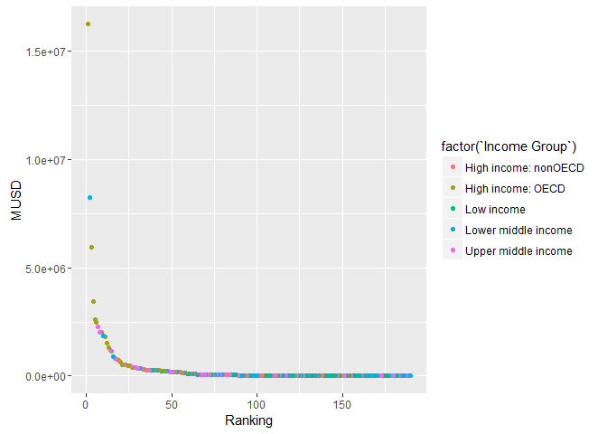

# CaseStudy1
Jacob Brionez  
October 27, 2016  

##Installed Packages

```r
library(ggplot2)
library(repmis)
library(RCurl)
```

```
## Loading required package: bitops
```

#Downloading URL and clean up prep for Merge

```r
site <-"https://d396qusza40orc.cloudfront.net/getdata%2Fdata%2FGDP.csv"
GDP <- source_data(site, sep=",", header=FALSE)
```

```
## Downloading data from: https://d396qusza40orc.cloudfront.net/getdata%2Fdata%2FGDP.csv
```

```
## SHA-1 hash of the downloaded data file is:
## 18dd2f9ca509a8ace7d8de3831a8f842124c533d
```

```
## Warning in fread(data, sep = sep, header = header, data.table = F,
## stringsAsFactors = stringsAsFactors, : Bumped column 6 to type character
## on data row 67, field contains 'a'. Coercing previously read values in this
## column from logical, integer or numeric back to character which may not
## be lossless; e.g., if '00' and '000' occurred before they will now be just
## '0', and there may be inconsistencies with treatment of ',,' and ',NA,' too
## (if they occurred in this column before the bump). If this matters please
## rerun and set 'colClasses' to 'character' for this column. Please note
## that column type detection uses the first 5 rows, the middle 5 rows and the
## last 5 rows, so hopefully this message should be very rare. If reporting to
## datatable-help, please rerun and include the output from verbose=TRUE.
```

```r
GDP <- GDP[-c(3,6,7,8,9,10)] #removing empty columns
names(GDP) <- c("CountryCode","Ranking","Economy","MUSD")  #Names for Columns
GDPFinal <- subset(x=GDP, MUSD != "..") #Removes .. from MUSD column
GDPFinal <- subset(x=GDPFinal, Ranking != "Gross domestic product 2012")
GDPFinal <- subset(x=GDPFinal, Ranking != "Ranking")
GDPFinal <- subset(x=GDPFinal, Ranking != "Note: Rankings include only those economies with confirmed GDP estimates. Figures in italics are for 2011 or 2010.")
GDPFinal <- subset(x=GDPFinal, Ranking != "a. Includes Former Spanish Sahara.  b. Excludes South Sudan  c. Covers mainland Tanzania only. d. Data are for the area")
GDPFinal <- subset(x=GDPFinal, Ranking != "controlled by the government of the Republic of Cyprus.   e. Excludes Abkhazia and South Ossetia.  f. Excludes Transnistria.")
GDPFinal <- subset(x=GDPFinal, Ranking >0) #Removes Outliers Items with no MUSD or that are not countries


urladdress <-"https://d396qusza40orc.cloudfront.net/getdata%2Fdata%2FEDSTATS_Country.csv"
EDU <- source_data(urladdress, sep=",", header=TRUE)
```

```
## Downloading data from: https://d396qusza40orc.cloudfront.net/getdata%2Fdata%2FEDSTATS_Country.csv
```

```
## SHA-1 hash of the downloaded data file is:
## 20be6ae8245b5a565a815c18a615a83c34745e5e
```
#Merge of Datasets GDPFinal and EDU

```r
GDPEDUdata <- merge(x=GDPFinal, y=EDU, by = "CountryCode", all=TRUE) #Merge of data by CountryCode
```
##Question 1
#Merge the data based on the country shortcode. How many of the IDs match?
#Based on the Merge of the Country Education Data and the Gross Domestic Product Data, there were 190 matches
#for countries that had GDP data available and that had Education Data entered.

```r
GDPEDUdataRank <- subset(x=GDPEDUdata, Ranking > 0) #Remove non matched data
GDPEDUdataRank <- dplyr::arrange(GDPEDUdataRank, Ranking)
GDPEDUdataRank[c(1:2)]
```

```
##     CountryCode Ranking
## 1           USA       1
## 2           IND      10
## 3           SLV     100
## 4           TTO     101
## 5           CYP     102
## 6           EST     103
## 7           ZMB     104
## 8           AFG     105
## 9           UGA     106
## 10          NPL     107
## 11          HND     108
## 12          GAB     109
## 13          CAN      11
## 14          GNQ     110
## 15          BIH     111
## 16          ZAR     112
## 17          BRN     113
## 18          GEO     114
## 19          PNG     115
## 20          JAM     116
## 21          BWA     117
## 22          MOZ     118
## 23          SEN     119
## 24          AUS      12
## 25          KHM     120
## 26          COG     121
## 27          ISL     122
## 28          NAM     123
## 29          TCD     124
## 30          ALB     125
## 31          NIC     126
## 32          MUS     127
## 33          BFA     128
## 34          MLI     129
## 35          ESP      13
## 36          MNG     130
## 37          SSD     131
## 38          MDG     132
## 39          ARM     133
## 40          ZWE     134
## 41          MKD     135
## 42          LAO     136
## 43          MLT     137
## 44          BHS     138
## 45          HTI     139
## 46          MEX      14
## 47          BEN     140
## 48          MDA     141
## 49          RWA     142
## 50          TJK     143
## 51          NER     144
## 52          KGZ     145
## 53          KSV     146
## 54          MCO     147
## 55          GIN     148
## 56          BMU     149
## 57          KOR      15
## 58          SUR     150
## 59          MNE     151
## 60          MWI     152
## 61          BRB     153
## 62          MRT     154
## 63          FJI     155
## 64          TGO     156
## 65          SLE     157
## 66          SWZ     158
## 67          ERI     159
## 68          IDN      16
## 69          GUY     160
## 70          ABW     161
## 71          BDI     162
## 72          LSO     163
## 73          MDV     164
## 74          CAF     165
## 75          CPV     166
## 76          BTN     167
## 77          LBR     168
## 78          BLZ     169
## 79          TUR      17
## 80          TMP     170
## 81          LCA     171
## 82          ATG     172
## 83          SYC     173
## 84          SLB     174
## 85          GMB     175
## 86          GNB     176
## 87          VUT     177
## 88          GRD     178
## 89          KNA     178
## 90          NLD      18
## 91          VCT     180
## 92          WSM     181
## 93          COM     182
## 94          DMA     183
## 95          TON     184
## 96          FSM     185
## 97          STP     186
## 98          PLW     187
## 99          MHL     188
## 100         KIR     189
## 101         SAU      19
## 102         TUV     190
## 103         CHN       2
## 104         CHE      20
## 105         SWE      21
## 106         IRN      22
## 107         NOR      23
## 108         POL      24
## 109         BEL      25
## 110         ARG      26
## 111         AUT      27
## 112         ZAF      28
## 113         VEN      29
## 114         JPN       3
## 115         COL      30
## 116         THA      31
## 117         ARE      32
## 118         DNK      33
## 119         MYS      34
## 120         SGP      35
## 121         CHL      36
## 122         HKG      37
## 123         EGY      38
## 124         NGA      39
## 125         DEU       4
## 126         ISR      40
## 127         PHL      41
## 128         GRC      42
## 129         FIN      43
## 130         PAK      44
## 131         PRT      45
## 132         IRL      46
## 133         IRQ      47
## 134         DZA      48
## 135         PER      49
## 136         FRA       5
## 137         KAZ      50
## 138         CZE      51
## 139         ROM      52
## 140         UKR      53
## 141         QAT      54
## 142         NZL      55
## 143         KWT      56
## 144         VNM      57
## 145         HUN      58
## 146         BGD      59
## 147         GBR       6
## 148         AGO      60
## 149         PRI      61
## 150         MAR      62
## 151         SVK      63
## 152         ECU      64
## 153         SYR      65
## 154         OMN      66
## 155         CUB      67
## 156         AZE      68
## 157         BLR      69
## 158         BRA       7
## 159         LKA      70
## 160         HRV      71
## 161         DOM      72
## 162         SDN      73
## 163         LUX      74
## 164         UZB      75
## 165         BGR      76
## 166         GTM      77
## 167         URY      78
## 168         TUN      79
## 169         RUS       8
## 170         SVN      80
## 171         CRI      81
## 172         MAC      82
## 173         LBN      83
## 174         LTU      84
## 175         ETH      85
## 176         GHA      86
## 177         KEN      87
## 178         SRB      88
## 179         PAN      89
## 180         ITA       9
## 181         YEM      90
## 182         TKM      91
## 183         JOR      92
## 184         BHR      93
## 185         LVA      94
## 186         TZA      95
## 187         BOL      96
## 188         PRY      97
## 189         CMR      98
## 190         CIV      99
```
##Question 2
#Sort the data frame in ascending order by GDP (so United States is last). What is the 13th
#country in the resulting data frame?

```r
GDPEDUdataRank$MUSD<-as.numeric(gsub("\\,","",GDPEDUdataRank$MUSD)) #remove commas and change to numeric
GDPEDUdataRank$MUSD<-as.numeric(gsub("\\$","",GDPEDUdataRank$MUSD)) #remove Dollar signs and change to numeric
GDPEDUdataRank$Ranking<-as.numeric(GDPEDUdataRank$Ranking) #convert Rankings to Numeric
GDPEDUdataRank <- dplyr::arrange(GDPEDUdataRank, MUSD) #
GDPEDUdataRank[c(1:2)]
```

```
##     CountryCode Ranking
## 1           TUV     190
## 2           KIR     189
## 3           MHL     188
## 4           PLW     187
## 5           STP     186
## 6           FSM     185
## 7           TON     184
## 8           DMA     183
## 9           COM     182
## 10          WSM     181
## 11          VCT     180
## 12          GRD     178
## 13          KNA     178
## 14          VUT     177
## 15          GNB     176
## 16          GMB     175
## 17          SLB     174
## 18          SYC     173
## 19          ATG     172
## 20          LCA     171
## 21          TMP     170
## 22          BLZ     169
## 23          LBR     168
## 24          BTN     167
## 25          CPV     166
## 26          CAF     165
## 27          MDV     164
## 28          LSO     163
## 29          BDI     162
## 30          ABW     161
## 31          GUY     160
## 32          ERI     159
## 33          SWZ     158
## 34          SLE     157
## 35          TGO     156
## 36          FJI     155
## 37          MRT     154
## 38          BRB     153
## 39          MWI     152
## 40          MNE     151
## 41          SUR     150
## 42          BMU     149
## 43          GIN     148
## 44          MCO     147
## 45          KSV     146
## 46          KGZ     145
## 47          NER     144
## 48          TJK     143
## 49          RWA     142
## 50          MDA     141
## 51          BEN     140
## 52          HTI     139
## 53          BHS     138
## 54          MLT     137
## 55          LAO     136
## 56          MKD     135
## 57          ZWE     134
## 58          ARM     133
## 59          MDG     132
## 60          SSD     131
## 61          MNG     130
## 62          MLI     129
## 63          BFA     128
## 64          MUS     127
## 65          NIC     126
## 66          ALB     125
## 67          TCD     124
## 68          NAM     123
## 69          ISL     122
## 70          COG     121
## 71          KHM     120
## 72          SEN     119
## 73          MOZ     118
## 74          BWA     117
## 75          JAM     116
## 76          PNG     115
## 77          GEO     114
## 78          BRN     113
## 79          ZAR     112
## 80          BIH     111
## 81          GNQ     110
## 82          GAB     109
## 83          HND     108
## 84          NPL     107
## 85          UGA     106
## 86          AFG     105
## 87          ZMB     104
## 88          EST     103
## 89          CYP     102
## 90          TTO     101
## 91          SLV     100
## 92          CIV      99
## 93          CMR      98
## 94          PRY      97
## 95          BOL      96
## 96          TZA      95
## 97          LVA      94
## 98          BHR      93
## 99          JOR      92
## 100         TKM      91
## 101         YEM      90
## 102         PAN      89
## 103         SRB      88
## 104         KEN      87
## 105         GHA      86
## 106         ETH      85
## 107         LTU      84
## 108         LBN      83
## 109         MAC      82
## 110         CRI      81
## 111         SVN      80
## 112         TUN      79
## 113         URY      78
## 114         GTM      77
## 115         BGR      76
## 116         UZB      75
## 117         LUX      74
## 118         SDN      73
## 119         DOM      72
## 120         HRV      71
## 121         LKA      70
## 122         BLR      69
## 123         AZE      68
## 124         CUB      67
## 125         OMN      66
## 126         SYR      65
## 127         ECU      64
## 128         SVK      63
## 129         MAR      62
## 130         PRI      61
## 131         AGO      60
## 132         BGD      59
## 133         HUN      58
## 134         VNM      57
## 135         KWT      56
## 136         NZL      55
## 137         QAT      54
## 138         UKR      53
## 139         ROM      52
## 140         CZE      51
## 141         KAZ      50
## 142         PER      49
## 143         DZA      48
## 144         IRQ      47
## 145         IRL      46
## 146         PRT      45
## 147         PAK      44
## 148         FIN      43
## 149         GRC      42
## 150         PHL      41
## 151         ISR      40
## 152         NGA      39
## 153         EGY      38
## 154         HKG      37
## 155         CHL      36
## 156         SGP      35
## 157         MYS      34
## 158         DNK      33
## 159         ARE      32
## 160         THA      31
## 161         COL      30
## 162         VEN      29
## 163         ZAF      28
## 164         AUT      27
## 165         ARG      26
## 166         BEL      25
## 167         POL      24
## 168         NOR      23
## 169         IRN      22
## 170         SWE      21
## 171         CHE      20
## 172         SAU      19
## 173         NLD      18
## 174         TUR      17
## 175         IDN      16
## 176         KOR      15
## 177         MEX      14
## 178         ESP      13
## 179         AUS      12
## 180         CAN      11
## 181         IND      10
## 182         ITA       9
## 183         RUS       8
## 184         BRA       7
## 185         GBR       6
## 186         FRA       5
## 187         DEU       4
## 188         JPN       3
## 189         CHN       2
## 190         USA       1
```

#KNA is the Thirteenth country on the list.

##Question 3
#What are the average GDP rankings for the "High income: OECD" and "High income:nonOECD" groups?

```r
HighIncomeOECD <- subset(GDPEDUdataRank, `Income Group` == "High income: OECD")
HighIncomeOECD$Ranking<-as.numeric(HighIncomeOECD$Ranking) #convert Rankings to Numeric
HighIncomeOECD[c(1,6)] #CheckValues in Income Group Column
```

```
##     CountryCode      Income Group
## 69          ISL High income: OECD
## 111         SVN High income: OECD
## 117         LUX High income: OECD
## 128         SVK High income: OECD
## 133         HUN High income: OECD
## 136         NZL High income: OECD
## 140         CZE High income: OECD
## 145         IRL High income: OECD
## 146         PRT High income: OECD
## 148         FIN High income: OECD
## 149         GRC High income: OECD
## 151         ISR High income: OECD
## 158         DNK High income: OECD
## 164         AUT High income: OECD
## 166         BEL High income: OECD
## 167         POL High income: OECD
## 168         NOR High income: OECD
## 170         SWE High income: OECD
## 171         CHE High income: OECD
## 173         NLD High income: OECD
## 176         KOR High income: OECD
## 178         ESP High income: OECD
## 179         AUS High income: OECD
## 180         CAN High income: OECD
## 182         ITA High income: OECD
## 185         GBR High income: OECD
## 186         FRA High income: OECD
## 187         DEU High income: OECD
## 188         JPN High income: OECD
## 190         USA High income: OECD
```

```r
summary(HighIncomeOECD)
```

```
##  CountryCode           Ranking         Economy               MUSD         
##  Length:30          Min.   :  1.00   Length:30          Min.   :   13579  
##  Class :character   1st Qu.: 12.25   Class :character   1st Qu.:  211147  
##  Mode  :character   Median : 24.50   Mode  :character   Median :  486528  
##                     Mean   : 32.97                      Mean   : 1483917  
##                     3rd Qu.: 45.75                      3rd Qu.: 1480047  
##                     Max.   :122.00                      Max.   :16244600  
##                                                                           
##   Long Name         Income Group          Region         
##  Length:30          Length:30          Length:30         
##  Class :character   Class :character   Class :character  
##  Mode  :character   Mode  :character   Mode  :character  
##                                                          
##                                                          
##                                                          
##                                                          
##  Lending category   Other groups       Currency Unit     
##  Length:30          Length:30          Length:30         
##  Class :character   Class :character   Class :character  
##  Mode  :character   Mode  :character   Mode  :character  
##                                                          
##                                                          
##                                                          
##                                                          
##  Latest population census Latest household survey Special Notes     
##  Length:30                Length:30               Length:30         
##  Class :character         Class :character        Class :character  
##  Mode  :character         Mode  :character        Mode  :character  
##                                                                     
##                                                                     
##                                                                     
##                                                                     
##  National accounts base year National accounts reference year
##  Length:30                   Min.   :1995                    
##  Class :character            1st Qu.:2000                    
##  Mode  :character            Median :2000                    
##                              Mean   :2000                    
##                              3rd Qu.:2000                    
##                              Max.   :2007                    
##                              NA's   :17                      
##  System of National Accounts SNA price valuation
##  Min.   :1993                Length:30          
##  1st Qu.:1993                Class :character   
##  Median :1993                Mode  :character   
##  Mean   :1993                                   
##  3rd Qu.:1993                                   
##  Max.   :1993                                   
##  NA's   :8                                      
##  Alternative conversion factor PPP survey year
##  Length:30                     Min.   :2005   
##  Class :character              1st Qu.:2005   
##  Mode  :character              Median :2005   
##                                Mean   :2005   
##                                3rd Qu.:2005   
##                                Max.   :2005   
##                                               
##  Balance of Payments Manual in use External debt Reporting status
##  Length:30                         Length:30                     
##  Class :character                  Class :character              
##  Mode  :character                  Mode  :character              
##                                                                  
##                                                                  
##                                                                  
##                                                                  
##  System of trade    Government Accounting concept
##  Length:30          Length:30                    
##  Class :character   Class :character             
##  Mode  :character   Mode  :character             
##                                                  
##                                                  
##                                                  
##                                                  
##  IMF data dissemination standard
##  Length:30                      
##  Class :character               
##  Mode  :character               
##                                 
##                                 
##                                 
##                                 
##  Source of most recent Income and expenditure data
##  Length:30                                        
##  Class :character                                 
##  Mode  :character                                 
##                                                   
##                                                   
##                                                   
##                                                   
##  Vital registration complete Latest agricultural census
##  Length:30                   Length:30                 
##  Class :character            Class :character          
##  Mode  :character            Mode  :character          
##                                                        
##                                                        
##                                                        
##                                                        
##  Latest industrial data Latest trade data Latest water withdrawal data
##  Min.   :2001           Min.   :2008      Min.   :2000                
##  1st Qu.:2004           1st Qu.:2008      1st Qu.:2000                
##  Median :2004           Median :2008      Median :2000                
##  Mean   :2004           Mean   :2008      Mean   :2000                
##  3rd Qu.:2004           3rd Qu.:2008      3rd Qu.:2000                
##  Max.   :2005           Max.   :2008      Max.   :2004                
##  NA's   :1                                NA's   :5                   
##  2-alpha code        WB-2 code          Table Name       
##  Length:30          Length:30          Length:30         
##  Class :character   Class :character   Class :character  
##  Mode  :character   Mode  :character   Mode  :character  
##                                                          
##                                                          
##                                                          
##                                                          
##   Short Name       
##  Length:30         
##  Class :character  
##  Mode  :character  
##                    
##                    
##                    
## 
```
#Average Ranking is 32.97

```r
HighIncomenonOECD <- subset(GDPEDUdataRank, `Income Group` == "High income: nonOECD")
HighIncomenonOECD$Ranking<-as.numeric(HighIncomenonOECD$Ranking) #convert Rankings to Numeric
HighIncomenonOECD[c(1,6)] #CheckValues in Income Group Column
```

```
##     CountryCode         Income Group
## 30          ABW High income: nonOECD
## 38          BRB High income: nonOECD
## 42          BMU High income: nonOECD
## 44          MCO High income: nonOECD
## 53          BHS High income: nonOECD
## 54          MLT High income: nonOECD
## 78          BRN High income: nonOECD
## 81          GNQ High income: nonOECD
## 88          EST High income: nonOECD
## 89          CYP High income: nonOECD
## 90          TTO High income: nonOECD
## 97          LVA High income: nonOECD
## 98          BHR High income: nonOECD
## 109         MAC High income: nonOECD
## 120         HRV High income: nonOECD
## 125         OMN High income: nonOECD
## 130         PRI High income: nonOECD
## 135         KWT High income: nonOECD
## 137         QAT High income: nonOECD
## 154         HKG High income: nonOECD
## 156         SGP High income: nonOECD
## 159         ARE High income: nonOECD
## 172         SAU High income: nonOECD
```

```r
summary(HighIncomenonOECD)
```

```
##  CountryCode           Ranking         Economy               MUSD       
##  Length:23          Min.   : 19.00   Length:23          Min.   :  2584  
##  Class :character   1st Qu.: 58.50   Class :character   1st Qu.: 12838  
##  Mode  :character   Median : 94.00   Mode  :character   Median : 28373  
##                     Mean   : 91.91                      Mean   :104350  
##                     3rd Qu.:125.00                      3rd Qu.:131205  
##                     Max.   :161.00                      Max.   :711050  
##                                                                         
##   Long Name         Income Group          Region         
##  Length:23          Length:23          Length:23         
##  Class :character   Class :character   Class :character  
##  Mode  :character   Mode  :character   Mode  :character  
##                                                          
##                                                          
##                                                          
##                                                          
##  Lending category   Other groups       Currency Unit     
##  Length:23          Length:23          Length:23         
##  Class :character   Class :character   Class :character  
##  Mode  :character   Mode  :character   Mode  :character  
##                                                          
##                                                          
##                                                          
##                                                          
##  Latest population census Latest household survey Special Notes     
##  Length:23                Length:23               Length:23         
##  Class :character         Class :character        Class :character  
##  Mode  :character         Mode  :character        Mode  :character  
##                                                                     
##                                                                     
##                                                                     
##                                                                     
##  National accounts base year National accounts reference year
##  Length:23                   Min.   :1997                    
##  Class :character            1st Qu.:1998                    
##  Mode  :character            Median :1998                    
##                              Mean   :1998                    
##                              3rd Qu.:1999                    
##                              Max.   :2000                    
##                              NA's   :21                      
##  System of National Accounts SNA price valuation
##  Min.   :1993                Length:23          
##  1st Qu.:1993                Class :character   
##  Median :1993                Mode  :character   
##  Mean   :1993                                   
##  3rd Qu.:1993                                   
##  Max.   :1993                                   
##  NA's   :16                                     
##  Alternative conversion factor PPP survey year
##  Length:23                     Min.   :2005   
##  Class :character              1st Qu.:2005   
##  Mode  :character              Median :2005   
##                                Mean   :2005   
##                                3rd Qu.:2005   
##                                Max.   :2005   
##                                NA's   :8      
##  Balance of Payments Manual in use External debt Reporting status
##  Length:23                         Length:23                     
##  Class :character                  Class :character              
##  Mode  :character                  Mode  :character              
##                                                                  
##                                                                  
##                                                                  
##                                                                  
##  System of trade    Government Accounting concept
##  Length:23          Length:23                    
##  Class :character   Class :character             
##  Mode  :character   Mode  :character             
##                                                  
##                                                  
##                                                  
##                                                  
##  IMF data dissemination standard
##  Length:23                      
##  Class :character               
##  Mode  :character               
##                                 
##                                 
##                                 
##                                 
##  Source of most recent Income and expenditure data
##  Length:23                                        
##  Class :character                                 
##  Mode  :character                                 
##                                                   
##                                                   
##                                                   
##                                                   
##  Vital registration complete Latest agricultural census
##  Length:23                   Length:23                 
##  Class :character            Class :character          
##  Mode  :character            Mode  :character          
##                                                        
##                                                        
##                                                        
##                                                        
##  Latest industrial data Latest trade data Latest water withdrawal data
##  Min.   :1997           Min.   :2006      Min.   :2000                
##  1st Qu.:2005           1st Qu.:2008      1st Qu.:2000                
##  Median :2005           Median :2008      Median :2000                
##  Mean   :2004           Mean   :2008      Mean   :2002                
##  3rd Qu.:2005           3rd Qu.:2008      3rd Qu.:2003                
##  Max.   :2005           Max.   :2008      Max.   :2006                
##  NA's   :13             NA's   :3         NA's   :10                  
##  2-alpha code        WB-2 code          Table Name       
##  Length:23          Length:23          Length:23         
##  Class :character   Class :character   Class :character  
##  Mode  :character   Mode  :character   Mode  :character  
##                                                          
##                                                          
##                                                          
##                                                          
##   Short Name       
##  Length:23         
##  Class :character  
##  Mode  :character  
##                    
##                    
##                    
## 
```
#Average Ranking is 91.91

##Question 4
#Plot the GDP for all of the countries. Use ggplot2 to color your plot by Income Group.
#g<-g+ggtitle("GDP")
#g+theme(plot.title = element_text(size=20, face="bold", vjust=1, lineheight=0.6))
#g+theme(legend.title = element_text(colour="chocolate", size=16, face="bold"))

```r
g<-ggplot(GDPEDUdataRank, aes(Ranking, MUSD, color=factor(`Income Group`)))+geom_point()
g
```

<!-- -->

##Question 5
#Cut the GDP ranking into 5 separate quantile groups. Make a table versus Income.Group.
#How many countries are Lower middle income but among the 38 nations with highest
#GDP?

##Additional Info - Exploration
#quantile(GDPEDUdataRank$MUSD)
#brks <- with(GDPEDUdataRank, quantile(MUSD, probs = c(0, 0.20, 0.40, 0.60, 0.8, 1)))
#GDPEDUdataRankQant <- within(GDPEDUdataRank, quantile <- cut(MUSD, breaks = brks, labels = 1:5, include.lowest = TRUE))

```r
brks2 <- with(GDPEDUdataRank, quantile(Ranking, probs = c(0, 0.20, 0.40, 0.60, 0.8, 1)))
GDPEDUdataRankQantRnk <- within(GDPEDUdataRank, quantile <- cut(Ranking, breaks = brks2, labels = 1:5, include.lowest = TRUE))
```
#Table

```r
table(GDPEDUdataRankQantRnk$quantile, GDPEDUdataRankQantRnk$`Income Group`, exclude = NULL)
```

```
##       
##        High income: nonOECD High income: OECD Low income
##   1                       4                18          0
##   2                       5                10          1
##   3                       8                 1          9
##   4                       4                 1         16
##   5                       2                 0         11
##   <NA>                    0                 0          0
##       
##        Lower middle income Upper middle income <NA>
##   1                      5                  11    0
##   2                     13                   9    0
##   3                     12                   8    0
##   4                      8                   8    1
##   5                     16                   9    0
##   <NA>                   0                   0    0
```

#Separating out the Lower middle income group for comparison to ranking of Top 38 GDP Countries
#```{r}
#LowerMiddleIncome <- subset(GDPEDUdataRankQant, `Income Group` == "Lower middle income") #create subset for Lower Middle Income
#LowerMiddleIncomeTop38GDP <- subset(LowerMiddleIncome, Ranking <= 38) #create additional subset with top 38 GDPs
#LowerMiddleIncomeTop38GDP[c(1:2)] #list of GDPs with both that are both in the lower Middle income group and in top 38 GDPs
#```
#Five countries are in the lower middle income group that are in the top 38 GDP.
#CHN (2)
#IND (10)
#IDN (16)
#THA (31)
#EGY (38)
