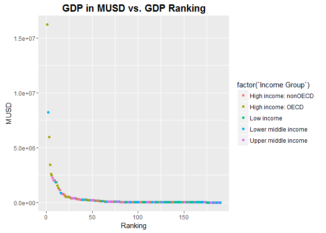

# GDPIncomeAnalysis
Jacob Brionez  
October 31, 2016  
#Introduction

The World Bank Group has set two goals for the world to achieve by 2030:

End extreme poverty by decreasing the percentage of people living on less than $1.90 a day to no more than 3%

Promote shared prosperity by fostering the income growth of the bottom 40% for every country

The World Bank is a vital source of financial and technical assistance to developing countries around the world. 
The World Bank Group comprises five institutions managed by their member countries.

Established in 1944, the World Bank Group is headquartered in Washington, D.C. and has more than 10,000 employees
in more than 120 offices worldwide.

The World Bank provides free and open access to global development data that it collects on their website
at data.worldbank.org.  This analysis will utilize this data to provide insight into countries of various GDP
levels and the income levels of the people who live in those countries.  

We are utilizing the following queried data sets in our analysis:

Education Statistics - The World Bank EdStats All Indicator Query

GDP Ranking - Gross domestic product ranking table


#Installed Packages

```r
library(ggplot2)
library(repmis)
library(RCurl)
```

```
## Loading required package: bitops
```

```r
library(dplyr)
```

```
## 
## Attaching package: 'dplyr'
```

```
## The following objects are masked from 'package:stats':
## 
##     filter, lag
```

```
## The following objects are masked from 'package:base':
## 
##     intersect, setdiff, setequal, union
```

```r
setwd("C:/MSDS 6306-Fall2016/CaseStudy1")
```
#Download data from The World Bank and cleanup for merge - GDP Ranking & Education Statistics

```r
source("Data/DownloadDataTheWorldBank.R")
```

```
## Downloading data from: https://d396qusza40orc.cloudfront.net/getdata%2Fdata%2FGDP.csv
```

```
## SHA-1 hash of the downloaded data file is:
## 18dd2f9ca509a8ace7d8de3831a8f842124c533d
```

```
## Warning in fread(data, sep = sep, header = header, data.table = F,
## stringsAsFactors = stringsAsFactors, : Bumped column 6 to type character
## on data row 67, field contains 'a'. Coercing previously read values in this
## column from logical, integer or numeric back to character which may not
## be lossless; e.g., if '00' and '000' occurred before they will now be just
## '0', and there may be inconsistencies with treatment of ',,' and ',NA,' too
## (if they occurred in this column before the bump). If this matters please
## rerun and set 'colClasses' to 'character' for this column. Please note
## that column type detection uses the first 5 rows, the middle 5 rows and the
## last 5 rows, so hopefully this message should be very rare. If reporting to
## datatable-help, please rerun and include the output from verbose=TRUE.
```

```
## Downloading data from: https://d396qusza40orc.cloudfront.net/getdata%2Fdata%2FEDSTATS_Country.csv
```

```
## SHA-1 hash of the downloaded data file is:
## 20be6ae8245b5a565a815c18a615a83c34745e5e
```
#Analysis 1

A Merge of the data based on the country shortcode was performed for this analysis.
Based on the Merge of the Country Education Data and the GDP Ranking, there were 190 matches
for countries that had GDP data available and that had Education Data entered.


```r
source("Data/MergeData.R")
source("Analysis/Analysis1.R")
```
#Analysis 2

A sort of the data frame was done in ascending order by GDP (so United States is last). 
Saint Kitts and Nevis (KNA) is the Thirteenth country on the list.


```r
source("Analysis/Analysis2.R")
```
#Analysis 3

The average GDP rankings for the "High income: OECD" group is 32.97 and 91.91 for the "High income:nonOECD" group.  Countries that are
members of the OECD had higher world GDP rankings than those countries that were not members of the OECD.

The Organization for Economic Cooperation and Development (OECD) is a unique forum where the governments of 34 democracies with market 
economies work with each other, as well as with more than 70 non-member economies to promote economic growth, prosperity, and sustainable development.


```r
source("Analysis/Analysis3.R")
```


#Analysis 4

The Plot below shows the GDP for all countries included in this analysis vs their world ranking. We used different colors to
represent the different income groups for household income levels in those countries.  From the 80 to 190 GDP rankings you see
that the colors showing different income groups are a little more uniform in color but at rankings of 1 though 50 there is a lot 
more variation in color.  This would indicate that while the GDP for some of these countries is very high it does not indicate 
that the household income level is high as well.


```r
g<-ggplot(GDPEDUdataRank, aes(Ranking, MUSD, color=factor(`Income Group`)))+geom_point()
g<-g+ggtitle("GDP in MUSD vs. GDP Ranking")
g+theme(plot.title = element_text(size=15, face="bold", vjust=1, lineheight=0.6))
```

<!-- -->


#Analysis 5

For this analysis we cut the GDP ranking into 5 separate quantile groups:

1 - GDP Ranking 1 - 38

2 - GDP Ranking 1 - 38

3 - GDP Ranking 1 - 38

4 - GDP Ranking 1 - 38

5 - GDP Ranking 1 - 38

The Table Below shows the number of countries in each quantile group above versus the following Income Groups:

High Income: nonOECD

High Income: OECD

Upper Middle Income

Lower Middle Income

Low Income

As you will notice, from the table there are five countries are in the lower middle income group that are in the top 38 GDP (Quantile 1).

CHN (2) The People's Republic of China

IND (10) Republic of India

IDN (16) Indonesia

THA (31) Thailand

EGY (38) Egypt


```r
source("Analysis/Analysis5.R")
```
#Table 1
note: The "<NA>" in this table is South Sudan (SSD). While it is listed as being in quantile 4 for GDP there is not information for Income Group for this country.

```r
table(GDPEDUdataRankQantRnk$quantile, GDPEDUdataRankQantRnk$`Income Group`, exclude = NULL)
```

```
##       
##        High income: nonOECD High income: OECD Low income
##   1                       4                18          0
##   2                       5                10          1
##   3                       8                 1          9
##   4                       4                 1         16
##   5                       2                 0         11
##   <NA>                    0                 0          0
##       
##        Lower middle income Upper middle income <NA>
##   1                      5                  11    0
##   2                     13                   9    0
##   3                     12                   8    0
##   4                      8                   8    1
##   5                     16                   9    0
##   <NA>                   0                   0    0
```

```r
LowerMiddleIncomeTop38GDP[c(1:2)] #list of GDPs with both that are both in the lower Middle income group and in top 38 GDPs
```

```
##     CountryCode Ranking
## 153         EGY      38
## 160         THA      31
## 175         IDN      16
## 181         IND      10
## 189         CHN       2
```

#Conclusion

Intuitively one would think there is a correlation between the GDP and household income level in a country.  This analysis shows that
this is not the case.  There are several countries that have very high GDP where the average income level of the country is very low compared
to other countries.  This may be due to the country's overall population, the type of government, education level, or even land mass.  
However, one can see there is more to consider when looking at the income of a country versus the the income of individuals in their populations.  
It is a continual effort to understand this and more importantly what factors contribute to poverty in these countries.  As we understand more the 
closer we will be to a solution and the ability to motivate change though adjusting these factors.


